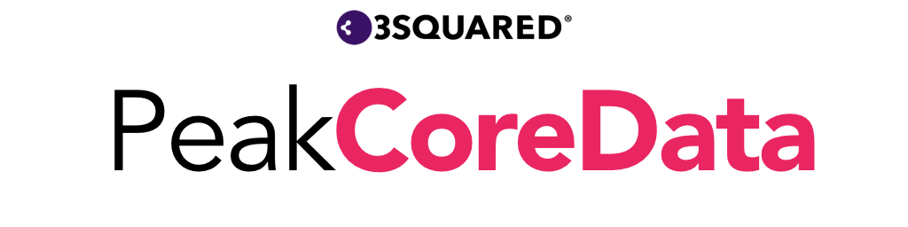

PeakCoreData is a Swift microframework providing enhancements and conveniences to [`CoreData`](https://developer.apple.com/documentation/coredata). It is part of the [Peak Framework](#peak-framework).

## Observers

### `ManagedObjectObserver`

The `ManagedObjectObserver` class can be used to observe changes made to a single managed object. State changes include when it is refreshed, updated or deleted.

```Swift
var event: Event!
var eventObserver: ManagedObjectObserver<Event>!

override func viewDidLoad() {
    super.viewDidLoad()
    
    eventObserver = ManagedObjectObserver(managedObject: event)
    eventObserver.startObserving() { [weak self] obj, changeType in
        guard let strongSelf = self else { return }
        switch changeType {
        case .initialised, .refreshed, .updated:
            strongSelf.updateView()
        case .deleted:
            strongSelf.navigationController?.popToRootViewController(animated: true)
        }
    }
}
```

### `CountObserver`

The `CountObserver` class can be used to observe changes to the number of `NSManagedObject` objects as defined by a generic type and an optional `NSPredicate`.

```Swift
var countObserver: CountObserver<Event>!

override func viewDidLoad() {
    super.viewDidLoad()

    let predicate = NSPredicate(format: "%K == false", argumentArray: [#KeyPath(Event.isHidden)])
    countObserver = CountObserver<Event>(predicate: predicate, context: viewContext)
    countObserver.startObserving() { [weak self] count in
        guard let strongSelf = self else { return }
        strongSelf.countLabel.text = String(count)
    }
}
```

## Fetched Data Sources

### `FetchedCollection`

TODO

### `FetchedCollectionViewDataSource` and `FetchedTableViewDataSource`

These classes take care of the boiler-plate code needed to use a `NSFetchedResultsController` with a `UITableView` or `UICollectionView`.

```Swift
class EventsTableViewController: UITableViewController {

    var dataSource: FetchedTableViewDataSource<EventsTableViewController>!

    override func viewDidLoad() {
        super.viewDidLoad()

        let frc = NSFetchedResultsController(
            fetchRequest: Event.sortedFetchRequest(), 
            managedObjectContext: viewContext, 
            sectionNameKeyPath: nil, 
            cacheName: nil
        )
        dataSource = FetchedTableViewDataSource(
            tableView: tableView, 
            cellIdentifier: EventTableViewCell.cellIdentifier, 
            fetchedResultsController: frc, 
            delegate: self
        )
        dataSource.animateUpdates = true
        dataSource.onDidChangeContent = {
            print("Something changed")
        }
        dataSource.performFetch()
    }
}

extension EventsTableViewController: FetchedTableViewDataSourceDelegate {
    
    func identifier(forCellAt indexPath: IndexPath) -> String {
        return EventTableViewCell.cellIdentifier
    }

    func configure(_ cell: EventTableViewCell, with object: Event) {
        cell.textLabel?.text = object.date?.description
    }
}
```

## Operations

### `CoreDataOperation`

`CoreDataOperation` is a concurrent `Operation` subclass that can be used to perform core data tasks on a background thread. To use, simply subclass `CoreDataOperation` then override the `performWork(in:)` method.

Things to note about this operation:

* `CoreDataOperation` simply wraps the `performBackgroundTask((NSManagedObjectContext) -> Void)` method on `NSPersistentContainer` in a operation.
* To finish the operation you must call `saveAndFinish()`.
* Changes will only be merged in to your `viewContext` if you have set the `automaticallyMergesChangesFromParent` on `viewContext` to `true`.
* `CoreDataOperation` conforms to `ProducesResult` and so can be used to produce a [`Result`](https://github.com/3squared/PeakResult).

### `CoreDataChangesetOperation`

A `CoreDataOperation` subclass that returns a `Changeset` struct containing all the `NSManagedObjectID` objects that were inserted and updated during the operation.

### `CoreDataBatchImportOperation` and `CoreDataSingleImportOperation`

Two `CoreDataChangesetOperation` subclasses that can be used to import an array of intermediate objects or a single intermediate object in to Core Data. They would normally be used to import `Decodable` objects from your web service. These operations work automatically as long as the following requirements are met:

* The intermediate object must conform to  `ManagedObjectUpdatable` and `UniqueIdentifiable`.
* The `NSManagedObject` type you are converting to must conform to `ManagedObjectType` and `UniqueIdentifiable`.

## Protocols

### `ManagedObjectType` and `UniqueIdentifiable`

To give your `NSManagedObject` subclasses access to a range of helper methods for inserting, deleting, fetching and counting, simply make them conform to the `ManagedObjectType` and `UniqueIdentifiable` protocols. Doing so will also allow you to use `CoreDataBatchImportOperation` and `CoreDataSingleImportOperation`.

### `PersistentContainerSettable`

Each view controller that needs access to the `NSPersistentContainer` should conform to `PersistentContainerSettable`. Conforming to this protocol gives you easy access to the `viewContext` property and a method for saving the `viewContext`. It also allows your `NSPersistentContainer` to be passed around more easily in `prepare(for:sender:)`.

```Swift
override func prepare(for segue: UIStoryboardSegue, sender: Any?) {
    if let controller = segue.destination as? PersistentContainerSettable {
        controller.persistentContainer = persistentContainer
    }
    if let navController = segue.destination as? UINavigationController, let controller = navController.topViewController as? PersistentContainerSettable {
        controller.persistentContainer = persistentContainer
    }
}
```

## Getting Started

### Installing

- Using Cocoapods, add `pod 'PeakCoreData'` to your Podfile.
- `import PeakCoreData` where necessary.

## Contributing

Please read [CONTRIBUTING.md](CONTRIBUTING.md) for details on our code of conduct, and the process for submitting pull requests to us.

## Versioning

We use [SemVer](http://semver.org/) for versioning.

## License

This project is licensed under the MIT License - see the [LICENSE.md](LICENSE.md) file for details

## Acknowledgments

* [Core Data by objc.io](https://www.objc.io/books/core-data/)

# Peak Framework

The Peak Framework is a collection of open-source microframeworks created by the team at [3Squared](https://github.com/3squared), named for the [Peak District](https://en.wikipedia.org/wiki/Peak_District). It is made up of:

|Name|Description|
|:--|:--|
|[PeakOperation](https://github.com/3squared/PeakOperation)|Provides enhancement and conveniences to `Operation`, making use of the `Result` type.|
|[PeakResult](https://github.com/3squared/PeakResult)|A simple `Result` type.|
|[PeakNetwork](https://github.com/3squared/PeakNetwork)|A networking framework built on top of `Session` using PeakOperation, leveraging the power of `Codable`.|